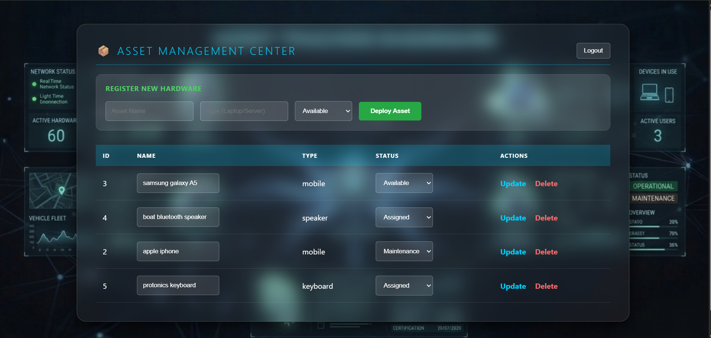

<div align="center">

# 🛠️ ASSET TRACKING SYSTEM
### Asset Tracking Solution Using Springboot

[](https://www.oracle.com/java/)
[](https://spring.io/projects/spring-boot)
[](https://www.postgresql.org/)
[](https://www.thymeleaf.org/)

*A Secure, Futuristic CRUD Application for Modern Enterprise Asset Control*
</div>

---

## 📖 Project Overview
The **Asset Tracking System** is a full-stack Spring Boot application designed for the Nesa Software interview assessment. It provides a secure, glassmorphism-inspired interface to manage corporate hardware lifecycle—from registration to maintenance and secure decommissioning.

---

## 📸 App Preview



---

## ✨ Key Features

* **Secure Authentication:** Custom login flow using Spring Security with session-based access control.
* **Advanced Asset Management:** Full CRUD operations for hardware assets (Laptops, Servers, Mobile Devices).
* **Partial Updates (PATCH):** Implemented via JavaScript Fetch API to modify specific fields without affecting the entire record.
* **Soft-Delete Logic:** Assets are never permanently erased; instead, they are flagged as deleted and hidden from all views using Hibernate `@SQLRestriction`.

### 🛡️ Core Reliability
* **Data Persistence:** Integrated with PostgreSQL for robust relational data storage.
* **Responsive Dashboard:** A futuristic UI built with Thymeleaf and CSS glassmorphism.
* **Security First:** Protected REST endpoints ensuring only authenticated users can modify asset data.

---

## 💻 Tech Stack

| Layer | Technology |
| :--- | :--- |
| **Backend** | Java 17+, Spring Boot 3.x, Spring Data JPA, Spring Security |
| **Frontend** | Thymeleaf, Vanilla JavaScript (ES6+), CSS3 (Glassmorphism) |
| **Database** | PostgreSQL |
| **Build Tool** | Maven |

---

## 🚦 Getting Started

### Prerequisites
* **JDK 17** or higher
* **Maven 3.x**
* **PostgreSQL** (Running on port 5432)

### Installation & Setup

1. Clone the repository:
```bash
git clone [https://github.com/faizal08/asset-tracking-system.git](https://github.com/faizal08/asset-tracking-system.git)
```

2.Navigate to the project directory:

```bash
cd asset-tracking-system
```

3.Configure your application.properties with your database credentials:

```bash
spring.datasource.url=jdbc:postgresql://localhost:5432/asset_db
spring.datasource.username=your_username
spring.datasource.password=your_password
```

4.Run the application:

```bash
mvn spring-boot:run
```

---

## 💡 Usage & Credentials

To test the full functionality of the system, follow these steps:

1. **Access the Application:** Open your web browser and navigate to: [http://localhost:8080/auth/login](http://localhost:8080/auth/login)

2. **Login Credentials:** Use the following administrative credentials to bypass the security wall:
   * **Username:** `admin`
   * **Password:** `admin123`

3. **Core Operations to Test:**
   * **Inventory Management:** Use the top form on the dashboard to add new hardware assets.
   * **Partial Updates (PATCH):** Modify the name or status in the table and click **Update** to trigger a partial JSON update.
   * **Secure Decommissioning:** Click **Delete** to trigger a **Soft-Delete**.
     * *Note:* The asset will disappear from the UI immediately as per requirements, but the record remains in the PostgreSQL database with the `is_deleted` flag set to `true`.

---

## Contact

For any inquiries or feedback, feel free to reach out:

- *Email:* [reachfaizal08@gmail.com](reachfaizal08@gmail.com)
- *GitHub:* [faizal08](https://github.com/faizal08)

